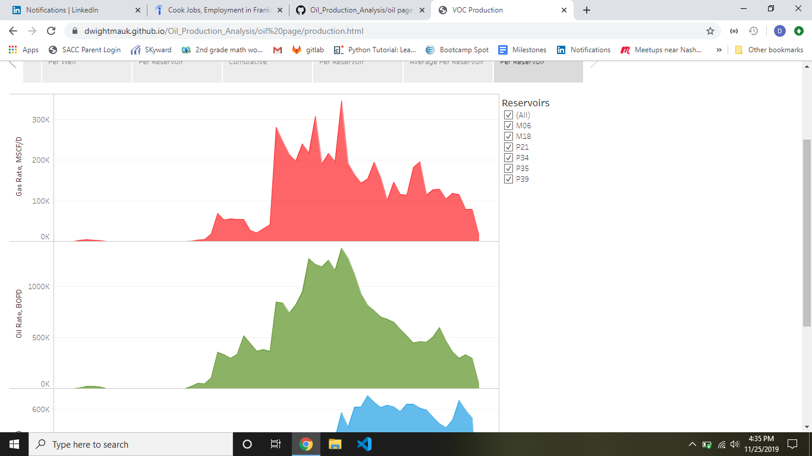

# Oil_Production_Analysis

Group project using Html, Tableau, and Machine Learning to tell the story and anaylze the history of the production of the wells and reservoirs to forecast the production of oil, gas, and water prduction of each well and reservoir.

